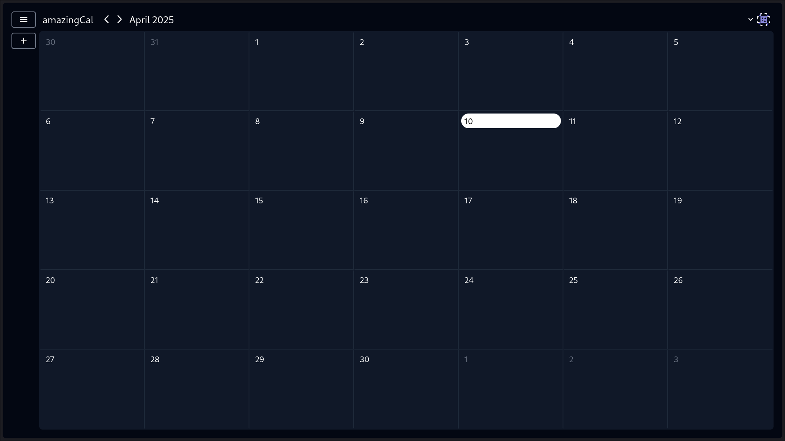

# AmazingCal

This is a calendar web app made with yew and actix web.



---

# Test it out

after cloning the repo, you are going to need to setup the connection with a supabase project.

## Setup

you are going to need to create a supabase project.

after creating a new project, you are going to need to modify these files:

```bash
backend/.DATABASE_URL.example
backend/.JWT_SECRET.example
frontend/.PUBLIC_ANON_KEY.example
frontend/.PUBLIC_SUPABASE_URL.example
```

remove the .example extension, and add your own connection details.

## Run

if you have docker installed, you can run the following command:

```bash
make test-deployment
```

if not, run these commands in separate terminals:

```bash
make backend
make frontend
```
